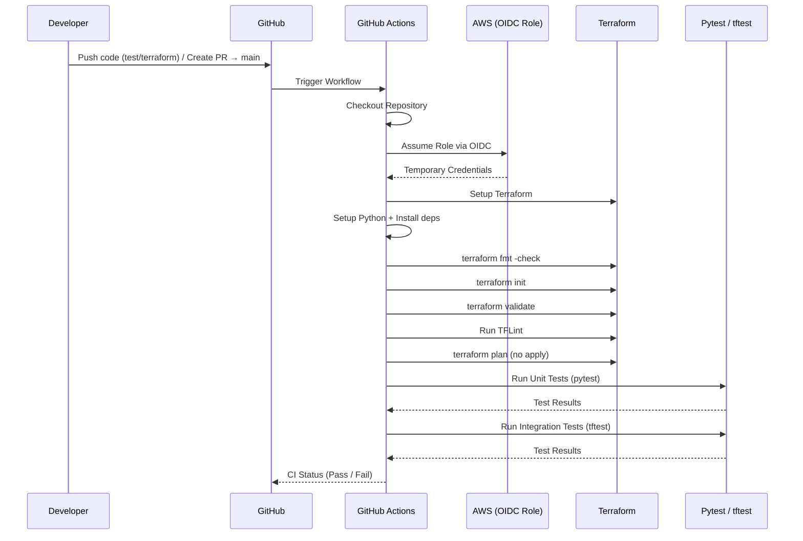

# 🚀 Terraform CI Pipeline

This repository contains a **CI pipeline for Terraform infrastructure validation and testing** using GitHub Actions.

The pipeline ensures that all Terraform code is properly formatted, validated, linted, and tested before being merged into `main`.


---

## 📌 Workflow Overview

The CI pipeline runs in two scenarios:

### 1. Push to Feature Branch

Triggered on:

```
test/terraform
```

### 2. Pull Request to `main`

Triggered when:

* A PR is opened targeting `main`

---

## 📂 Paths Monitored

The workflow runs only when relevant files change:

* `terraform/**`
* `tests/unit/test_terraform/**`
* `tests/integration/test_terraform/**`
* `**.tf`
* `.github/workflows/terraform-ci.yml`

---

## ⚙️ Pipeline Stages

The pipeline runs for **multiple environments** using a matrix:

```
dev | staging | prod
```

Each environment executes the following steps:

---

### ✅ 1. Checkout Code

Clones the repository into the runner.

---

### 🔐 2. Configure AWS Credentials (OIDC)

Uses GitHub OIDC to securely assume an AWS IAM role:

```yaml
role-to-assume: ${{ secrets.AWS_ASSUME_ROLE_ARN }}
```

No static credentials are used.

---

### 🌍 3. Set Environment Context

```bash
echo "Running for ${{ matrix.env }}"
```

---

### 🧰 4. Setup Terraform

* Version pinned: `1.10.0`
* Ensures consistent execution across environments

---

### 🐍 5. Setup Python

Used for:

* `pytest` (unit testing)
* `tftest` (Terraform integration testing)

---

### 📦 6. Install Dependencies

```bash
pip install pytest tftest
```

---

### 🎨 7. Terraform Format Check

```bash
terraform fmt -check -recursive
```

Ensures code follows Terraform formatting standards.

---

### 🔧 8. Terraform Init

* `dev` → No backend (safe for CI)
* `staging/prod` → Full initialization

```bash
terraform init
```

---

### 🧪 9. Terraform Validate

```bash
terraform validate
```

Checks syntax and configuration correctness.

---

### 🔍 10. TFLint (Static Analysis)

```bash
tflint --init
tflint --recursive
```

Detects:

* Bad practices
* Misconfigurations
* Cloud-specific issues

---

### 📊 11. Terraform Plan (No Apply)

```bash
terraform plan -input=false
```

Ensures infrastructure changes are valid **without applying them**.

---

### 🧪 12. Unit Tests (pytest)

```bash
pytest ../../../tests/unit/test_terraform
```

Used for:

* Logic validation
* Small, isolated tests

---

### 🔗 13. Integration Tests (tftest)

```bash
pytest ../../../tests/integration/test_terraform
```

Used for:

* Terraform module testing
* Mocked infrastructure validation

---

## 📁 Project Structure

```
.
├── terraform/
│   └── environment/
│       ├── dev/
│       ├── staging/
│       └── prod/
│
├── tests/
│   ├── unit/test_terraform/
│   └── integration/test_terraform/
│
└── .github/workflows/
    └── terraform-ci.yml
```

---

## 🔐 Required Secrets

Add the following secret in GitHub:

```
AWS_ASSUME_ROLE_ARN
```

This IAM role must:

* Trust GitHub OIDC provider
* Have required Terraform permissions

---

## 🎯 Key Features

* ✅ Multi-environment validation (dev, staging, prod)
* 🔐 Secure AWS access via OIDC (no secrets leakage)
* 🧪 Unit + integration testing
* 🔍 Static analysis with TFLint
* 🚫 No accidental infrastructure changes (no apply)
* ⚡ Path-based execution (faster CI)

---

## ⚠️ Important Notes

* `terraform apply` is **NOT** executed in this pipeline
* `dev` environment uses `-backend=false` to avoid remote state dependency
* Tests must be structured relative to Terraform directories

---

## 🚀 Future Improvements

* Add **cost estimation (Infracost)**
* Add **security scanning (tfsec / checkov)**
* Add **artifact upload (plan output)**
* Integrate **staging deployment pipeline**
* Add **manual approval before production**

---

## 💡 Summary

This CI pipeline ensures:

✔ Safe Terraform development
✔ Early error detection
✔ High code quality
✔ Confidence before deployment

---
