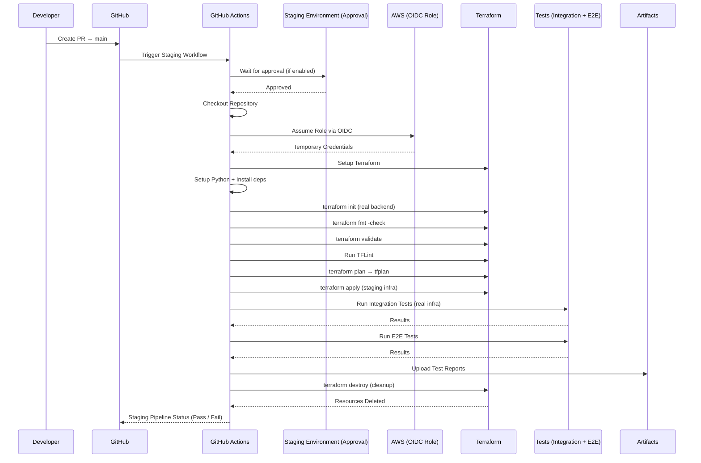

# 🚀 Terraform Staging Pipeline

This repository implements a **production-grade pipeline** for Terraform infrastructure using GitHub Actions.
It provisions infrastructure in a **staging environment**, runs tests, and **automatically cleans up resources**.



---

## 📌 Overview

This pipeline ensures that every pull request is validated against real infrastructure before merging into `main`.

### 🔄 Workflow Trigger

* Runs on: `pull_request` → `main`

---

## 🧱 Pipeline Architecture

```text
Pull Request → Staging Deploy → Testing → Cleanup → Merge Decision
```

### 🔁 Execution Flow

1. Checkout repository
2. Configure AWS credentials (OIDC)
3. Setup Terraform & Python
4. Install dependencies (`pytest`, `tftest`)
5. Terraform Init
6. Terraform Format Check
7. Terraform Validate
8. TFLint (linting)
9. Terraform Plan
10. Terraform Apply (staging infra)
11. Integration Tests
12. End-to-End (E2E) Tests
13. Upload test reports
14. Terraform Destroy (cleanup)

---

## ⚙️ Key Features

### 🔐 Secure Authentication

* Uses **OIDC (OpenID Connect)** with AWS
* No hardcoded credentials
* IAM Role assumed via:

  ```bash
  AWS_ASSUME_ROLE_ARN
  ```

---

### 🧪 Ephemeral Infrastructure Testing

* Infrastructure is:

  * ✅ Created during pipeline
  * ✅ Tested using real AWS resources
  * ✅ Destroyed after execution

👉 Ensures:

* No leftover resources
* Cost control
* Clean test environments

---

### 🧹 Automatic Cleanup

```yaml
if: always()
terraform destroy --auto-approve
```

* Runs even if tests fail
* Prevents resource leaks

---

### 🧵 Concurrency Control

```yaml
concurrency:
  group: staging-${{ github.ref }}
  cancel-in-progress: true
```

* Cancels previous runs on new commits
* Prevents overlapping executions

---

### 🧪 Testing Strategy

#### ✅ Integration Tests

* Validate Terraform resources
* Use real infrastructure

#### ✅ E2E Tests

* Simulate real-world usage
* Validate system behavior

#### 📊 Test Reports

* Generated in JUnit format:

  ```bash
  tests/reports/*.xml
  ```
* Uploaded as artifacts on failure

---

### 🧰 Code Quality Checks

* `terraform fmt` → formatting
* `terraform validate` → syntax validation
* `tflint` → best practices & linting

---

## 📁 Project Structure

```text
.
├── terraform/
│   └── environments/
│       └── staging/
│           ├── main.tf
│           ├── variables.tf
│           └── backend.tf
│
├── tests/
│   ├── integration/
│   ├── e2e/
│   └── reports/
│
└── .github/
    └── workflows/
        └── staging-deploy.yml
```

---

## 🛠️ Prerequisites

### 1. AWS Setup

* IAM Role with required permissions
* OIDC trust with GitHub

### 2. GitHub Secrets

| Secret Name           | Description           |
| --------------------- | --------------------- |
| `AWS_ASSUME_ROLE_ARN` | IAM Role ARN for OIDC |

---

## 🌍 Environment Configuration

```yaml
env:
  AWS_REGION: ap-south-1
```

---

## ⚠️ Important Notes

* This pipeline uses a **real Terraform backend**

* Ensure backend is configured for staging:

  ```hcl
  key = "staging/terraform.tfstate"
  ```

* Resources are **temporary** and destroyed after execution

---

## 🚀 Future Improvements

* 🔄 Production deployment pipeline with approval gates
* 🌱 Dynamic per-PR environments
* 📉 Drift detection
* 🔁 Rollback strategy
* 📊 Test reporting dashboard (Allure)

---

## 🧠 Why This Pipeline?

This design follows **industry best practices**:

* Infrastructure as Code (IaC)
* Shift-left testing
* Ephemeral environments
* Secure authentication
* Automated validation before merge

---

## 👨‍💻 Author

Rahul Shelke
Data Science & MLOps Enthusiast

---
